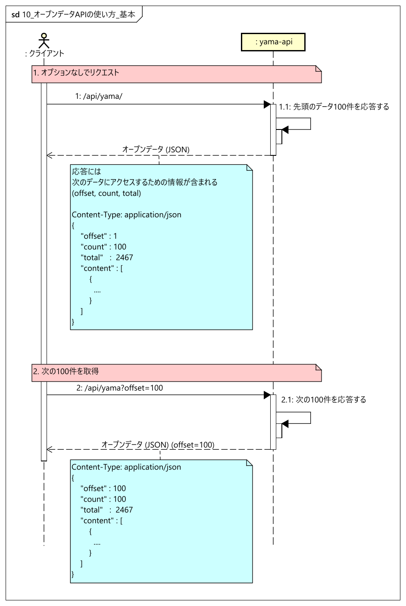
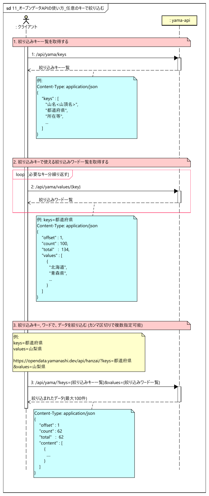

# 日本の主な山岳一覧 (国土地理院データ) API

日本の主な山岳の情報(山名, 都道府県, 所在等, 標高, 緯度経度, 三角点名等)が取得できるAPIです。

## 出典
- [日本の主な山岳一覧](https://www.gsi.go.jp/kihonjohochousa/kihonjohochousa41140.html)

本APIは [国土地理院コンテンツ利用規約](https://www.gsi.go.jp/kikakuchousei/kikakuchousei40182.html)に従い, WebページのコンテンツをAPI化しています。
   
## API 仕様
- https://opendata.yamanashi.dev/api/yama/docs を参照

## ライセンス
- 本ソフトウェアは、[MITライセンス](./LICENSE.txt)の元提供されています。

## 実行例
``` bash
curl -X 'GET' \
  'https://opendata.yamanashi.dev/api/yama/?count=100&offset=1' \
  -H 'accept: application/json'
```

``` bash
{
  "offset": 1,
  "count": 100,
  "total": 1059,
  "data": [
    {
      "山名<山頂名>": "知床岳",
      "都道府県": "北海道",
      "所在等": "知床・阿寒",
      "標高": "1254m",
      "緯度経度": "44度14分09秒145度16分26秒",
      "三角点名等": "知床岬",
      "備考": "",
      "url": "https://maps.gsi.go.jp/#15/44.23583333333333/145.2738888888889"
    },
    {
      ...
    },
    ...
  ]
}
```


## 使い方

- 基本の使い方


- 任意のキーで絞り込む

 

## 開発者向け情報

### 環境構築の手順

- 必要となるPythonバージョン: 3.8以上

**起動方法**
``` bash
$ pip install -r requirements.txt
$ uvicorn app.main:app --reload
```
### 設計情報

[API設計](./doc/API.md)
